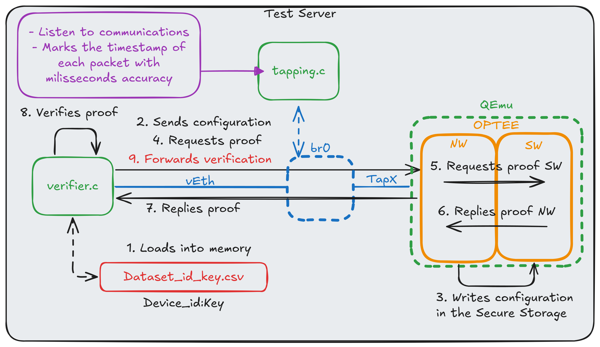
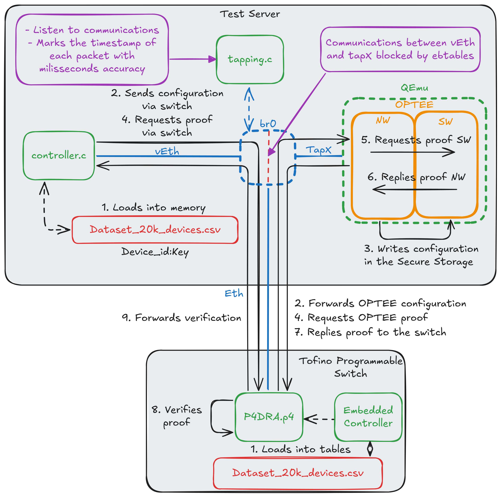
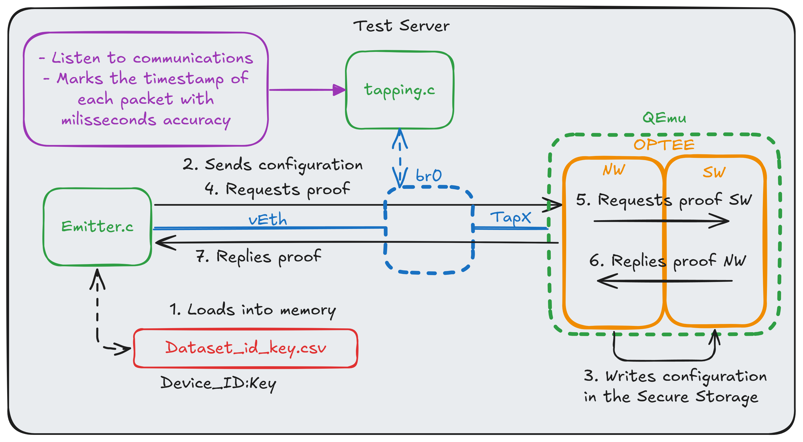
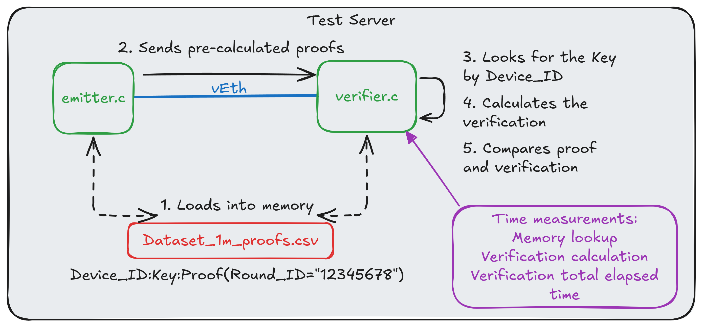
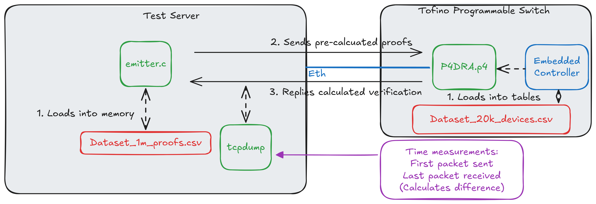

# P4DRA: Distributed remote attestation for data centers based on SDN and P4

## The implementation

Implementation of a protocol to perform the remote attestation of equipments in the contexts of data centers using programmable network devices based on the TNA (*Tofino Native Architecture*)

This is a version of the repository without the files under IP protection by Intel, according to ICA's (*Intel Communications Academy*) NDA.

## The attestation proof calculation algorithm

This implementation uses the stream cipher algorithm Forro14 for calculating the attestation proof. The Forro14 algorithm was proposed by Coutinho *et al.* in the paper [Latin Dances Reloaded: Improved Cryptanalysis Against Salsa and ChaCha, and the Proposal of Forró
](https://link.springer.com/chapter/10.1007/978-3-031-22963-3_9) and the repository [forro_cipher](https://github.com/murcoutinho/forro_cipher) which has a C lang reference implementation.

Some modifications were made in the reference implementation for calculation of the attestation proof instead of an encryption keystream. The modified algorithm is available in the [forro_cipher](forro_cipher) in this repository.

## Verifier implementation in TNA

The implementation developed for the Tofino programmable ASIC is avaiable in the [TNA](TNA) folder. To use this implementation, it's necessary to add the Scapy VEnv used by the BF-SDE with the following steps:

- Install BF-SDE 9.9.0 or newer
- add the following BF-SDE loading line on the user's bashrc:
    > cd; . ~/tools/set_sde.bash; sde
- Install Scapy on the VEnv:
```
source ~/bf-sde-9.9.0/install/lib/python3.8/venv/scripts/common/activate
sudo python3 -m pip install --upgrade pip
sudo python3 -m pip install scapy
```

Since BF-SDE is Intel IP and can't be distributed, it's up to each user to obtain the BF-SDE and the tools from ICA.

## Prover implementation in OP-TEE

The Prover based in the TrustZone technology was developed using [OPTEE](https://optee.readthedocs.io/en/latest/faq/faq.html#faq-try-optee). The required steps for compiling and running this environment are described in the [optee_dra](optee_dra) folder. It's necessary to compile the emulated OPTEE test environment before running experiments 1, 2 and 3.

# Dataset and Tools for experimentation

The C-lang Tools used for sending and receiving packets with the datasets from folder [data](../data) are available in the [tools](tools) folder. For each experiment discribed in the dissertation, the following steps can be performed.

Attention: Always run the scripts inside the `tools/` folder to find the necessary programs and files. For compiling a tool, run the command `make tool_name` without the `.c` extension.

## Experiment 1: x86 Verifier and OP-TEE



- The *verifier.c* is the `verifica_p4dra_rede.c` code and the *tapping.c* is the `le_p4dra_rede.c` code.
- For sending the proofs, the compiled program from the `envia_pedidos_host.c` code can be used on the same interface that the verifier program is listening on.
- The `id_chave_prova_20k.txt` data file can be used to load the memory of the verifier and sender programs.
- To configure the topology, the following commands can be used (as root):
    ```sh
    brctl addbr br0; ip link set dev br0 up; brctl setageing br0 0 #adds the "br0" Bridge

    ip link add dev veth0 type veth peer veth1; ip link set up dev veth0; ip link set up dev veth1 #adds the veths

    brctl addif br0 veth1 #adiciona a veth1 na bridge br0

    #Performs the isolation of veth1 with each emulated prover.
    num_devices="1"
    for i in $(seq 1 ${num_devices}); do
        ebtables -A FORWARD -i veth1 -o tap$((10#$i-1)) -d 52:54:00:00:00:$(printf "%02x\n" $i) -j ACCEPT
    done
    ebtables -A FORWARD -j DROP
    ```

- To start the OP-TEE using the tools available in the [optee_dra](optee_dra) folder after it has been compiled. For more information, check the folder.
    ```sh
    num_devices=1
    #Run from the scripts_auxiliares folder of optee_dra
    for i in $(seq 1 ${num_devices}); do ./run_optee.sh $i; sleep 3; done
    ```

- To run the tests: 
    - start an instance of the `le_p4dra_rede` program listening on the br0 interface in a terminal: `./build/le_p4dra_rede br0`
    - Start the `verifica_p4dra_rede` program listening on the veth0 interface in another terminal: `./build/verifica_p4dra_rede ../data/id_chave_prova_20k.txt veth0 100`;
    - send the OPTEE configuration with `./build/envia_setup_host_arquivo ../data/id_chave_prova_20k.txt veth0 1`
    - send 100 attestation requests to the OPTEE with: 
    ```sh
    for i in $(seq 1 100); do
        round_id="$(printf "%016x" $i)$(date +%N | sha256sum | cut -c1-16)"
        echo "$round_id"
        ./build/envia_pedidos_host veth0 "$round_id" 1
        sleep 1
    done
    ```

## Experiment 2: x86 Controller, PDP Verifier and OP-TEE



- The *verifier.c* is the file `verifica_p4dra_rede.c` and * tapping.c* is the file `le_p4dra_rede.c`.
- For sending the proofs, the compiled program from the envia_pedidos.c code can be used on the same interface that the verifier program is listening on.
- The id_chave_prova_20k.txt data file can be used to load the memory of the verifier and sender programs.
- To configure the topology, the following commands can be used (as root):

    ```sh
    num_devices=1 #number of devices to be emulated as prover

    brctl addbr br0; ip link set dev br0 up; brctl setageing br0 0 #adds the Bridge "br0"

    ip link add dev veth0 type veth peer veth1; ip link set up dev veth0; ip link set up dev veth1 #adds the VEths

    brctl addif br0 veth1 #adds veth1 to bridge br0

    #Isolates the veth1 for each emulated prover.
    interface_switch="ens1f0np0" # modify the interface according to your scenario
    brctl addif br0 ${interface_switch} #adds the switch interface to br0
    ebtables -A FORWARD -i veth1 -o ${interface_switch} -j ACCEPT
    ebtables -A FORWARD -i ${interface_switch} -o veth1 -j ACCEPT
    for i in $(seq 1 ${num_devices}); do
        ebtables -A FORWARD -i ${interface_switch} -o tap$((10#$i-1)) -d 52:54:00:00:00:$(printf "%02x\n" $i) -j ACCEPT
    done
    for i in $(seq 1 ${num_devices}); do
        ebtables -A FORWARD -o ${interface_switch} -i tap$((10#$i-1)) -s 52:54:00:00:00:$(printf "%02x\n" $i) -j ACCEPT
    done
    ebtables -A FORWARD -j DROP
    ```
- To start OP-TEE using the available tools at [optee_dra](optee_dra) folder after compiled. For more information, read the folder.
    ```sh
    num_devices="1"
    #run at 'optee_dra/scripts_auxiliares' folder
    for i in $(seq 1 ${num_devices}); do ./run_optee.sh $i; sleep 3; done
    ```
- Compile and run the `p4dra.p4` program at Tofino, configure the ports with ucli and insert the table records at the switch with the script `TNA/bfrt_python/setup.py`, modifying configurations according to your scenario.
- For running the tests: 
    - run an instance of the `le_p4dra_rede` program listening to the br0 interface in one terminal: `./build/le_p4dra_rede br0` 
    - send the OPTEE configuration with `./build/envia_setup_host_arquivo ../data/id_chave_prova_20k.txt veth0 1`
    - send 100 proof requests to the OPTEE with: 
        ```sh
        for i in $(seq 1 100); do
            round_id="$(printf "%016x" $i)$(date +%N | sha256sum | cut -c1-16)"
            echo "$round_id"
            ./build/envia_pedidos veth0 "$round_id" 1
            sleep 1
        done
        ```

## Experiment 3: OP-TEE prover



- *tapping.c* is the code `le_p4dra_rede.c`.
- To send the requests, the program from code `envia_pedidos_host.c` can be used on interface `veth0`.
- the dataset file `id_chave_prova_20k.txt` can be used to load the data into the memory of the emitter.
- Start the topology and the OP-TEE instance as described in [Experiment 1](#Experiment-1:-x86-Verifier-and-OP-TEE)
- For running the tests: 
    - Start an instance of the `le_p4dra_rede` program listening to the br0 interface in a terminal: `./build/le_p4dra_rede br0` 
    - Send the OPTEE configuration with `./build/envia_setup_host_arquivo ../data/id_chave_prova_20k.txt veth0 1`
    - Send 100 proof requests (with 1 second intervals) to OPTEE with: 
        ```sh
        for i in $(seq 1 100); do
            round_id="$(printf "%016x" $i)$(date +%N | sha256sum | cut -c1-16)"
            echo "$round_id"
            ./build/envia_pedidos_host veth0 "$round_id" 1
            sleep 1
        done
        ```

## Experiment 4: x86 Verifier



- The *verifier.c* is code `verifica_p4dra_rede.c`.
- For sending proofs, use the `envia_provas_arquivo.c` program at interface `veth1`.
- The dataset file `id_chave_prova_20k.txt` can be loaded to memory of the emitter and verifier programs..
- Create the veths pair with `ip link add dev veth0 type veth peer veth1; ip link set up dev veth0; ip link set up dev veth1`
- For running the tests:
    - Start program `verifica_p4dra_rede` listening to interface veth0 in a terminal: `./build/verifica_p4dra_rede ../data/id_chave_prova_20k.txt veth0 100`;
    - Start program `envia_provas_arquivo` listening to interface veth1 in another terminal: `id_rodada="3132333435363738"; ./build/envia_provas_arquivo ../data/id_chave_prova_20k.txt veth1 ${id_rodada} 100`

## Experiment 5: PDP Verifier 



- To send the requests, the program from code `envia_provas_arquivo.c` can be used with the interface connected to the switch.
- instead of tcpdump, the program `le_p4dra_rede.c` is used for the measurements in the interface connected to the switch: `interface_switch="eth0"; ./build/le_p4dra_rede ${interface_switch}` (change 'eth0' to your interface).
- The dataset file `id_chave_prova_20k.txt` can be loaded to the memory of the emitter program.
- Compile and run `p4dra.p4` in the Tofino, configure the ports with ucli and insert the records into the switch's tables with the `TNA/bfrt_python/setup.py` script changing configurations according to your scenario.
- For running the tests:
    - Start the program `envia_provas_arquivo` at the switch's interface in another terminal: `interface_switch="eth0"; round_id="3132333435363738"; ./build/envia_provas_arquivo ../data/id_chave_prova_20k.txt ${interface_switch} ${round_id} 100` (change 'eth0' to your interface)