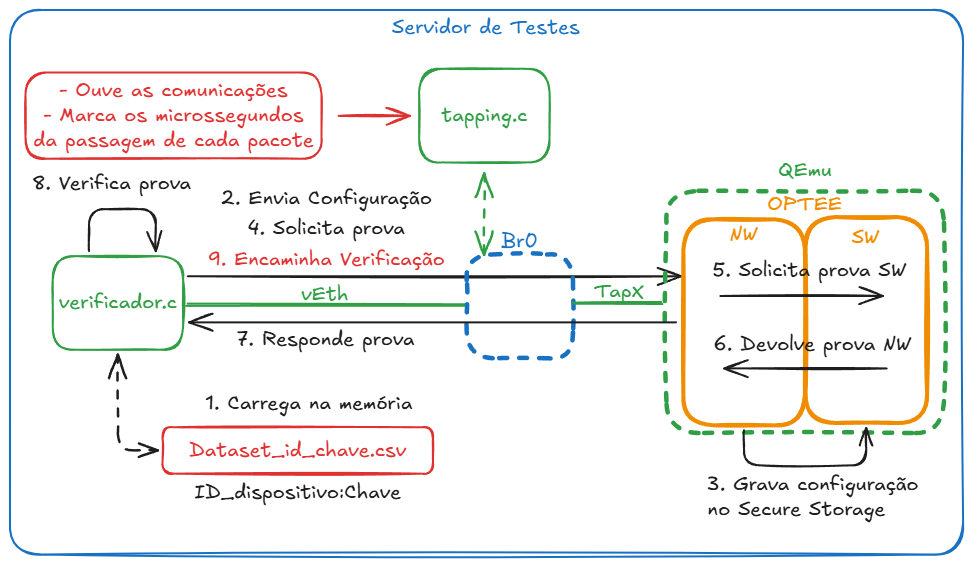
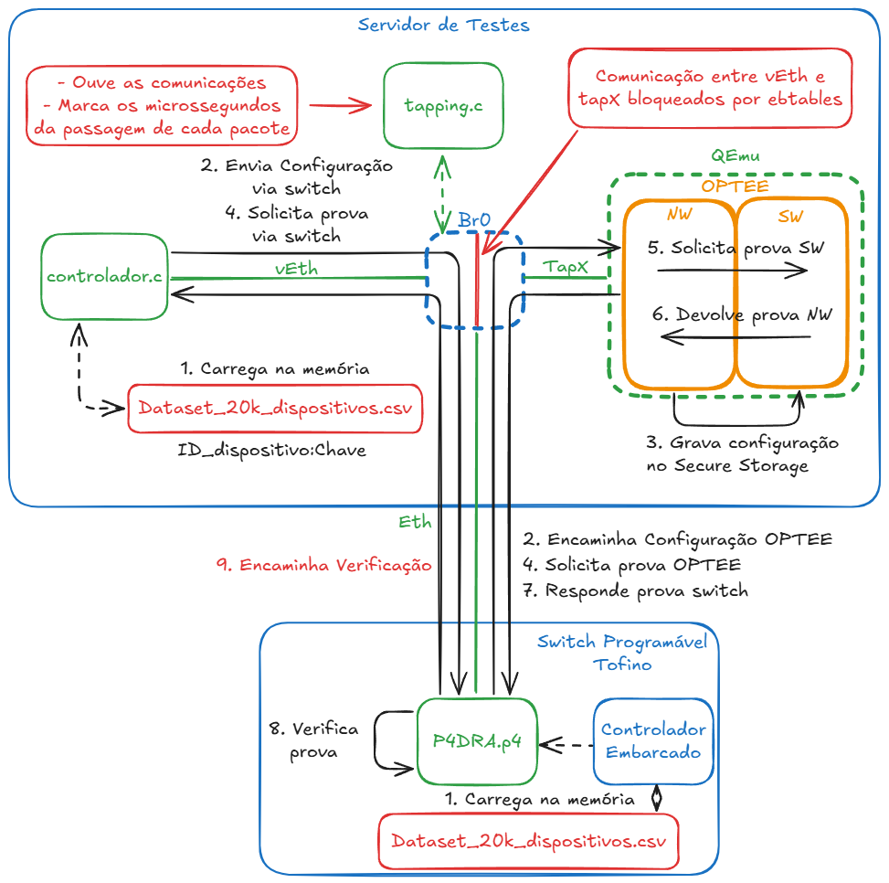
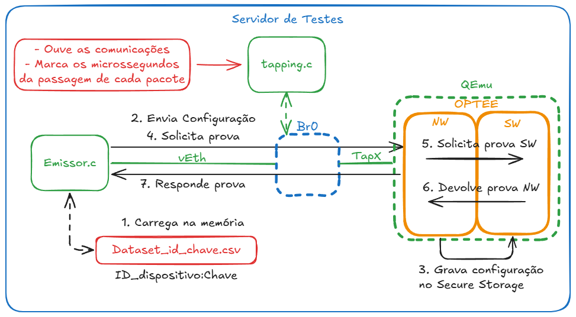
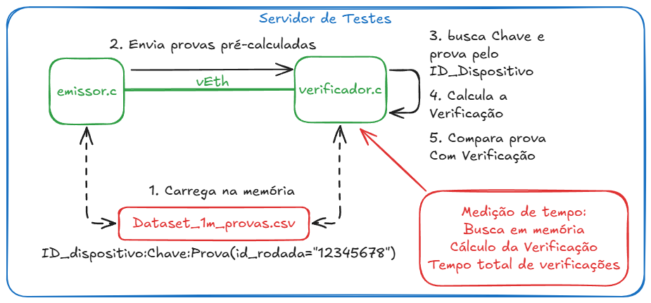
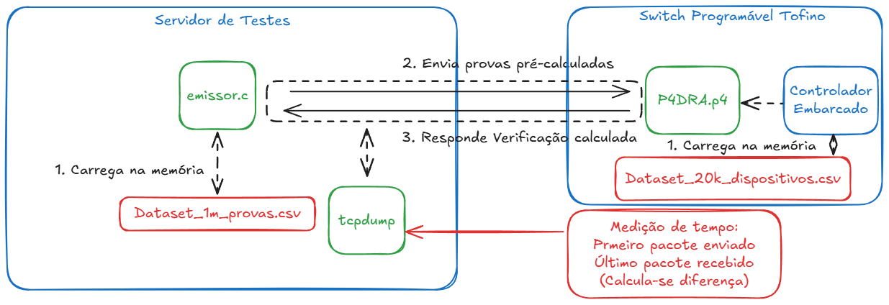

# P4DRA: Distributed remote attestation for data centers based on SDN and P4

There's an english version of this README [available here](README-en.md)

## A implementação

Implementação de um protocolo para realização de atestação remota de equipamentos no contexto de data centers utilizando dispositivos de rede programáveis, baseado na arquitetura TNA (*Tofino Native Architecture*).

Esta é uma versão do repositório sem arquivos de propriedade intelectual da Intel, conforme NDA de alunos do ICA (*Intel Communications Academy*).

## O algoritmo de cálculo de prova de atestação

Esta implementação utiliza como base o algoritmo Forro14 para cálculo da prova de atestação. O algoritmo Forro14 foi proposto por Murilo Coutinho *et al* no artigo [Latin Dances Reloaded: Improved Cryptanalysis Against Salsa and ChaCha, and the Proposal of Forró
](https://link.springer.com/chapter/10.1007/978-3-031-22963-3_9) e o repositório [forro_cipher](https://github.com/murcoutinho/forro_cipher) onde há o código de referência em C.

Algumas alterações foram realizadas na implementação de referência para que seja calculada a prova de atestação no lugar do *Keystream* de cifração. O algoritmo modificado está disponível na pasta [forro_cipher](forro_cipher) deste repositório.

## A implementação do verificador em TNA

A implementação realizada para a ASIC programável Tofino está disponível na pasta TNA. Para utilizá-la, é preciso fazer a adição do Scapy no venv utilizado pelo BF-SDE com os passos abaixo:

- Instalar o BF-SDE 9.9.0 ou superior
- adicionar a linha de carregamento do BF-SDE no fim do bashrc do usuário:
    > cd; . ~/tools/set_sde.bash; sde
- instalar o scapy no venv do SDE:
```
source ~/bf-sde-9.9.0/install/lib/python3.8/venv/scripts/common/activate
sudo python3 -m pip install --upgrade pip
sudo python3 -m pip install scapy
```

Como o BF-SDE é propriedade intelectual Intel e não pode ser distribuído, é responsabilidade do usuário a obtenção do BF-SDE e das ferramentas do ICA (*Intel Communication Academy*) junto à Intel e sua instalação.

Maiores detalhes de uso e configuração estão disponíveis na pasta [TNA](TNA)

## A implementação do provador em OP-TEE

O provador baseado na tecnologia TrustZone foi desenvolvido utilizando o [OPTEE](https://optee.readthedocs.io/en/latest/faq/faq.html#faq-try-optee). Os passos para compilar e executar esse ambiente estão descritos na pasta [optee_dra](optee_dra). Será necessário fazer a compilação e teste do ambiente OPTEE emulado antes de poder executar os experimentos 1, 2 e 3.

# Ferramentas e dados para experimentação

As ferramentas em C para envio e recebimento de pacotes utilizando os *datasets* da pasta [data](../data) estão disponíveis na pasta [tools](tools). Para cada experimento descrito na dissertação, os seguinte passos podem ser utilizados.

Atenção: Sempre execute as ferramentas da pasta `tools/` para facilitar encontrar os programas e arquivos necessários. Para compilar uma ferramenta, execute o comando `make nome_da_ferramenta` sem a extensão `.c`.

## Experimento 1: Verificador x86 e OP-TEE



- O *verificador.c* é o código `verifica_p4dra_rede.c` e o * tapping.c*  é o código `le_p4dra_rede.c`.
- Para envio das provas, o programa compilado do código `envia_pedidos_host.c` pode ser utilizado na mesma interface que o programa verificador está ouvindo.
- O arquivo de dados `id_chave_prova_20k.txt` pode ser utilizado para carregar a memória dos programas verificador e emissor.
- Para configuração da topologia, os seguinte comandos podem ser utilizados (como *root*):
    ```sh
    brctl addbr br0; ip link set dev br0 up; brctl setageing br0 0 #adiciona a Bridge "br0"

    ip link add dev veth0 type veth peer veth1; ip link set up dev veth0; ip link set up dev veth1 #adiciona as veth

    brctl addif br0 veth1 #adiciona a veth1 na bridge br0

    #Realiza o isolamento da veth1 com cada provador emulado.
    qtd_equipamentos="1"
    for i in $(seq 1 ${qtd_equipamentos}); do
        ebtables -A FORWARD -i veth1 -o tap$((10#$i-1)) -d 52:54:00:00:00:$(printf "%02x\n" $i) -j ACCEPT
    done
    ebtables -A FORWARD -j DROP
    ```
- Para iniciar o OP-TEE utilizando as ferramentas disponiveis na pasta [optee_dra](optee_dra) depois de já compilado. Mais orientações, verificar a pasta.
    ```sh
    quantidade_dispositivos=1
    #Rodar da pasta scripts_auxiliares do optee_dra
    for i in $(seq 1 ${quantidade_dispositivos}); do ./run_optee.sh $i; sleep 3; done
    ```
- Para rodar os testes: 
    - iniciar uma instância do programa `le_p4dra_rede` ouvindo na interface br0 em um terminal: `./build/le_p4dra_rede br0`
    - Iniciar o programa `verifica_p4dra_rede` ouvindo na interface veth0 em outro terminal: `./build/verifica_p4dra_rede ../data/id_chave_prova_20k.txt veth0 100`;
    - enviar a configuracao do OPTEE com `./build/envia_setup_host_arquivo ../data/id_chave_prova_20k.txt veth0 1`
    - enviar 100 pedidos de atestação para o OPTEE com: 
        ```sh
        for i in $(seq 1 100); do
            id_rodada="$(printf "%016x" $i)$(date +%N | sha256sum | cut -c1-16)"
            echo "$id_rodada"
            ./build/envia_pedidos_host veth0 "$id_rodada" 1
            sleep 1
        done
        ```

## Experimento 2: Controlador x86, verificador baseado em PDP e OP-TEE



- O *verificador.c* é o código `verifica_p4dra_rede.c` e o * tapping.c*  é o código `le_p4dra_rede.c`.
- Para envio das provas, o programa compilado do código `envia_pedidos.c` pode ser utilizado na mesma interface que o programa verificador está ouvindo.
- O arquivo de dados `id_chave_prova_20k.txt` pode ser utilizado para carregar a memória dos programas verificador e emissor.
- Para configuração da topologia, os seguinte comandos podem ser utilizados (como *root*):
    ```sh
    brctl addbr br0; ip link set dev br0 up; brctl setageing br0 0 #adiciona a Bridge "br0"

    ip link add dev veth0 type veth peer veth1; ip link set up dev veth0; ip link set up dev veth1 #adiciona as veth

    brctl addif br0 veth1 #adiciona a veth1 na bridge br0

    #Realiza o isolamento da veth1 com cada provador emulado.
    interface_switch="ens1f0np0" # modificar para seu cenário
    brctl addif br0 ${interface_switch} #Adicionando interface na br0
    ebtables -A FORWARD -i veth1 -o ${interface_switch} -j ACCEPT
    ebtables -A FORWARD -i ${interface_switch} -o veth1 -j ACCEPT
    for i in $(seq 1 ${quantidade_dispositivos}); do
        ebtables -A FORWARD -i ${interface_switch} -o tap$((10#$i-1)) -d 52:54:00:00:00:$(printf "%02x\n" $i) -j ACCEPT
    done
    for i in $(seq 1 ${quantidade_dispositivos}); do
        ebtables -A FORWARD -o ${interface_switch} -i tap$((10#$i-1)) -s 52:54:00:00:00:$(printf "%02x\n" $i) -j ACCEPT
    done
    ebtables -A FORWARD -j DROP
    ```
- Para iniciar o OP-TEE utilizando as ferramentas disponiveis na pasta [optee_dra](optee_dra) depois de já compilado. Mais orientações, verificar a pasta.
    ```sh
    qtd_equipamentos="1"
    #Rodar da pasta scripts_auxiliares do optee_dra
    for i in $(seq 1 ${qtd_equipamentos}); do ./run_optee.sh $i; sleep 3; done
    ```
- Compile e suba o programa `p4dra.p4` no Tofino, configure as portas com ucli e insira os registros das tabelas no switch com o script `TNA/bfrt_python/setup.py` alterando as configurações de acordo com sua topologia.
- Para rodar os testes: 
    - iniciar uma instância do programa `le_p4dra_rede` ouvindo na interface br0 em um terminal: `./build/le_p4dra_rede br0` 
    - enviar a configuracao do OPTEE com `./build/envia_setup_host_arquivo ../data/id_chave_prova_20k.txt veth0 1`
    - enviar 100 pedidos de atestação para o OPTEE com: 
        ```sh
        for i in $(seq 1 100); do
            id_rodada="$(printf "%016x" $i)$(date +%N | sha256sum | cut -c1-16)"
            echo "$id_rodada"
            ./build/envia_pedidos veth0 "$id_rodada" 1
            sleep 1
        done
        ```

## Experimento 3: Provador em OP-TEE



- O * tapping.c* é o código `le_p4dra_rede.c`.
- Para envio das provas, o programa compilado do código `envia_pedidos_host.c` pode ser utilizado na interface `veth0`.
- O arquivo de dados `id_chave_prova_20k.txt` pode ser utilizado para carregar a memória do programa emissor.
- Iniciar a topologia e a instância do OP-TEE conforme descrito no [Experimento 1](#experimento-1-verificador-x86-e-op-tee)
- Para rodar os testes: 
    - iniciar uma instância do programa `le_p4dra_rede` ouvindo na interface br0 em um terminal: `./build/le_p4dra_rede br0` 
    - enviar a configuracao do OPTEE com `./build/envia_setup_host_arquivo ../data/id_chave_prova_20k.txt veth0 1`
    - enviar 100 pedidos de atestação (em intervalos de 1 segundo) para o OPTEE com: 
        ```sh
        for i in $(seq 1 100); do
            id_rodada="$(printf "%016x" $i)$(date +%N | sha256sum | cut -c1-16)"
            echo "$id_rodada"
            ./build/envia_pedidos_host veth0 "$id_rodada" 1
            sleep 1
        done
        ```

## Experimento 4: Verificador baseado em x86



- O *verificador.c* é o código `verifica_p4dra_rede.c`.
- Para envio das provas, o programa compilado do código `envia_provas_arquivo.c` pode ser utilizado na interface `veth1`.
- O arquivo de dados `id_chave_prova_20k.txt` pode ser utilizado para carregar a memória do programa emissor e do verificador.
- Criar o par de veths com `ip link add dev veth0 type veth peer veth1; ip link set up dev veth0; ip link set up dev veth1`
- Para rodar os testes:
    - Iniciar o programa `verifica_p4dra_rede` ouvindo na interface veth0 em um terminal: `./build/verifica_p4dra_rede ../data/id_chave_prova_20k.txt veth0 100`;
    - iniciar o programa `envia_provas_arquivo` na interface veth1 no outro terminal com: `id_rodada="3132333435363738"; ./build/envia_provas_arquivo ../data/id_chave_prova_20k.txt veth1 ${id_rodada} 100`

## Experimento 5: Verificador baseado em PDP



- Para envio das provas, o programa compilado do código `envia_provas_arquivo.c` pode ser utilizado na interface conectada ao switch.
- Ao invés do tcpdump, o programa `le_p4dra_rede.c` pode ser utilizado para medições na interface conectada ao switch: `interface_switch="eth0"; ./build/le_p4dra_rede ${interface_switch}` (adaptar o eth0 à sua interface).
- O arquivo de dados `id_chave_prova_20k.txt` pode ser utilizado para carregar a memória do programa emissor.
- Compile e suba o programa `p4dra.p4` no Tofino, configure as portas com ucli e insira os registros das tabelas no switch com o script `TNA/bfrt_python/setup.py` alterando as configurações de acordo com sua topologia.
- Para rodar os testes:
    - iniciar o programa `envia_provas_arquivo` na interface do switch no outro terminal com: `interface_switch="eth0"; id_rodada="3132333435363738"; ./build/envia_provas_arquivo ../data/id_chave_prova_20k.txt ${interface_switch} ${id_rodada} 100` (adaptar o eth0 à sua interface)